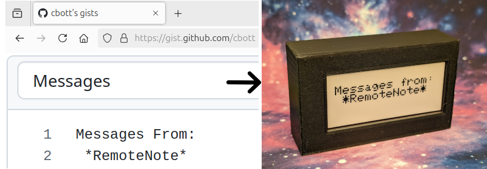

# RemoteNote
An E-Paper display that displays messages from the internet


## Parts
| Part | Product Name |
| ---- | ------------ |
| E-Paper Display | [Adafruit 2.9" Tri-Color eInk / ePaper Display FeatherWing - IL0373 - Red Black White](https://www.adafruit.com/product/4778) |
| Controller | [Adafruit Feather M0 WiFi](https://www.adafruit.com/product/3044) |
| Battery (optional) | [Adafruit LiPo](https://www.adafruit.com/product/3898) or similar with JST connector |
| Enclosure | 3D printed, see `Mechanicals` section |
| Fasteners (4x) | M2.5x3mm such as [McMaster PN 92095A113](https://www.mcmaster.com/92095A113/) |


## Setup
1. Install the Arduino IDE and add the relevant board manager and libraries as specified in https://learn.adafruit.com/adafruit-feather-m0-wifi-atwinc1500/setup
    - Complete the steps through the WiFi examples
1. Add the Adafruit EPD library per https://learn.adafruit.com/adafruit-2-9-eink-display-breakouts-and-featherwings/arduino-setup
    - For a quick test you can upload "eink_count_example" to confirm the display is working
1. Flash the SSL certificates for `docs.google.com` to your board
    - Once again, [this](https://learn.adafruit.com/adafruit-feather-m0-wifi-atwinc1500/updating-ssl-certificates) tutorial
    - Make sure to add the `setPins()` line to the WiFi101 "FirmwareUpdater" example sketch
    - I had to use an older 1.8.x version of the Arduino IDE to get the updater tool to work
1. Create a Google Sheets document and enable link sharing
    - Place your message in the cells
    - Fill in the last row with `#END` as the code will read up to that specific keyword
1. Create a file called `secrets.h` with the following definitions
    ```
    // secrets.h
    #define SECRET_SSID "your wifi ssid"
    #define SECRET_PASS "your wifi password"
    #define SHEET_ID "your spreadsheet id"
    ```
    where spreadsheet ID is taken from the url as
    `https://docs.google.com/spreadsheets/d/your spreadsheet id/edit#gid=0`
1. If you do not care about battery voltage sensing, update the `EPD_CS` define line in RemoteNote.ino to be 9 instead of 5
    - Assuming you want a nice battery percentage indicator, we need to modify the board a bit because the FeatherWing uses pin 9 (analog A7) for chip select, even though the Feather board uses that same pin for battery sensing.
    - Cut the jumper traces on the back of the FeatherWing labeled ECS and SDCS, and solder a jumper from the far side of ECS to the pin side of SDCS.
    - This will prevent SD card use but makes our code work correctly.
1. Upload the RemoteNote program to your board and see your messages on the e-paper display!


## Mechanicals
View the enclosure CAD model on [OnShape](https://cad.onshape.com/documents/76b6aed29cb626f62f2135a7/w/0958c09a086547eda7430ec1/e/3ca19d261f35867c617a01a6?renderMode=0&uiState=66629d7bdb745d72a6409b78)

CAD models for boards provided by [Adafruit_CAD_Parts](https://github.com/adafruit/Adafruit_CAD_Parts) repository


## Notes
- RemoteNote is a Minimum Viable Product. There are probably many other projects which do the same thing but I have set this up to be as easy to get started with as possible - no wiring, API keys, or fancy stuff.
- The Adafruit feather board's integrated battery controller charges at a rate of 200mA. Ensure that this does not exceed the capabilities of your chosen battery, likely requires a capacity >200mAh.
- Some of the code may be easier with [CircuitPython](https://learn.adafruit.com/adafruit-2-9-eink-display-breakouts-and-featherwings/circuitpython-usage), unfortunately the Feather M0 does not have the memory needed for the `displayio` builtin library. Rather than finding a workaround I just switched to Arduino.
